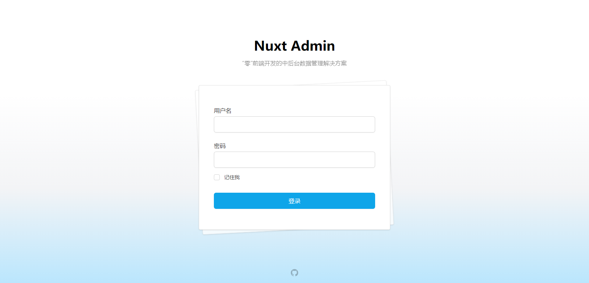
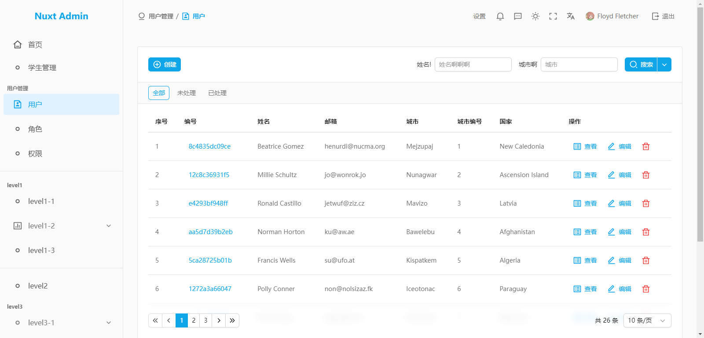

# nuxtAdmin

::: warning 注意：

此项目正处于快速迭代的初期阶段，部分功能可能会随时调整。

:::

这是一个“零”前端开发的中后台数据管理解决方案，基于 nuxt.js v3 版本开发。

如果你是一位前端开发者，你可以摆脱那些毫无意义的数据管理页面，把精力聚焦到非标类页面的开发。同时你也可以基于 nuxtAdmin 尝试全栈开发。

如果你是一位后端开发者，nuxtAdmin 让你不再畏惧前端，可以在完全不写前端的情况下搭建一个数据管理后台。

## 相关地址

- [Demo 演示](https://nuxtAdmin.muyi.dev)
- [Document 文档](https://www.muyi.dev/open_source/nuxtAdmin/)
- [github 源码](https://github.com/NMTuan/nuxtAdmin)

## 预览截图

## 开发背景

中后台数据管平台算是各产品必备的程序，每个项目总要写一个数据管理程序，总不能一直操作数据库吧。

说是数据管理无非就是一个又一个的数据表格。每加一个功能都要 cv 上一个功能表格，改一下列表项、查询项、以及其它琐碎的东西。两年前我开发了 [ezAdmin](/open_source/ezAdmin) 和 [ezAdmin3](/open_source/ezAdmin3)，把“DOM 拷贝和修改”的工作变成了“修改 json 配置”来控制一个数据表格组件的渲染。相对于修改大段的 DOM，修改 json 显得时髦了许多（至少不会因为忘记闭合标签而让页面错版，特别是浏览器牛逼的渲染修正能力，让你没有察觉这个问题，等哪天修改别的功能的时候，突然页面错版了，一脸懵逼的找不到原因！）。

这就行了么？不！我连修改 json 都不想做，这种无意义的工作我一点兴趣都没有。于是在 2023 年底开始构思新版本。经过一些尝试，我成功的把修改 json 这件事情扔给了后端开发人员。而我，只需专注非标类页面的制作即可。（甩工作的事情不是人人都可以的，但平时拿 nuxtAdmin 开发个小玩意还是非常方便的。）

## 技术架构

`Nuxt v3` `NuxtUI` `Pinia`
